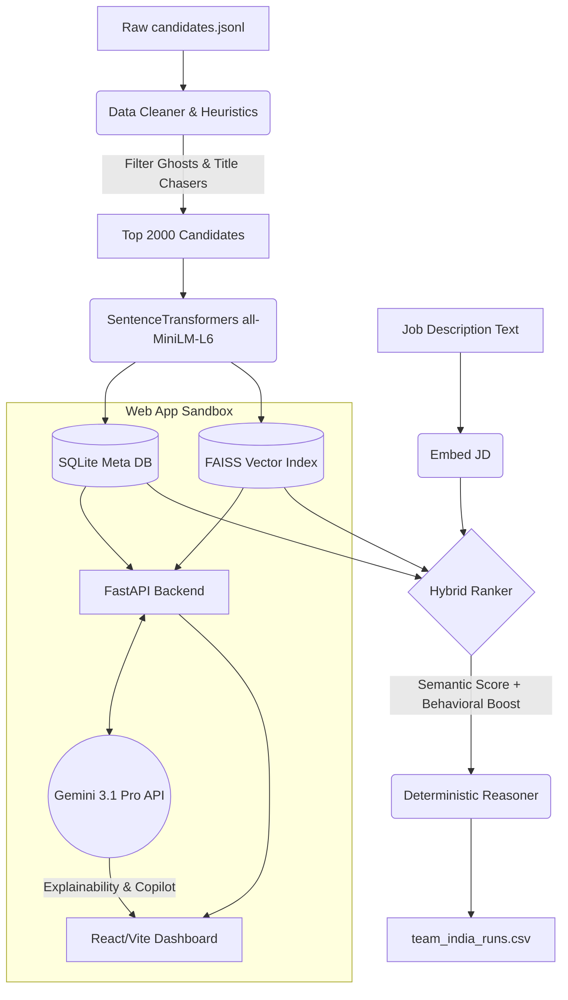

# 🚀 Intelligent Candidate Discovery Platform

<p align="center">


</p>

<p align="center">
AI-powered recruitment platform that intelligently analyzes resumes, ranks candidates, detects suspicious profiles, and provides explainable hiring recommendations using semantic search and Large Language Models.
</p>

---

## 🌐 Live Demo

🔗 https://bright-dolphin-df77cd.netlify.app

---

# 📑 Table of Contents

- [Overview](#-overview)
- [Features](#-features)
- [Technology Stack](#-technology-stack)
- [System Architecture](#-system-architecture)
- [Project Structure](#-project-structure)
- [Installation](#-installation)
- [AI Workflow](#-ai-workflow)
- [Future Improvements](#-future-improvements)
- [Team](#-team)
- [License](#-license)

---

# 📖 Overview

The Intelligent Candidate Discovery Platform is an AI-powered hiring assistant developed for the **IndiaRuns Data & AI Challenge**.

Instead of relying only on keyword matching, the platform performs **semantic resume analysis**, **vector similarity search**, and **LLM-based reasoning** to identify the most suitable candidates while providing transparent explanations for every ranking.

The solution is designed for recruiters, HR teams, and hiring managers to reduce manual screening time and improve hiring quality.

---

# ✨ Features

- 🤖 AI Resume Ranking
- 🔍 Semantic Candidate Search
- 📄 Resume Parsing
- 📊 Candidate Leaderboard
- 🧠 Explainable AI Recommendations
- ⚠️ Behavioral Trap Detection
- 🚀 Fast Vector Search with FAISS
- 📈 Recruiter Analytics Dashboard
- 💬 LLM-powered Hiring Rationale
- 🔒 Offline Candidate Ranking Support

---

# 🛠️ Technology Stack

| Technology | Used For |
|------------|----------|
| **Python** | Core backend development, AI pipeline, resume processing, and ranking engine |
| **FastAPI** | Building high-performance REST APIs and integrating AI services |
| **React.js** | Creating a modern, responsive, and interactive recruiter dashboard |
| **JavaScript** | Client-side logic and dynamic user interactions |
| **HTML5 & CSS3** | Designing responsive and user-friendly interfaces |
| **Google Gemini API** | Generating AI-powered hiring explanations, resume summaries, and candidate insights |
| **FAISS** | Performing fast semantic vector search to retrieve the most relevant candidates |
| **Sentence Transformers** | Converting resumes into dense vector embeddings for semantic similarity matching |
| **Pandas** | Loading, cleaning, preprocessing, and managing resume datasets |
| **NumPy** | Numerical computations and vector operations within the AI pipeline |
| **REST APIs** | Enabling communication between the frontend and backend services |
| **Git & GitHub** | Version control, collaboration, and project management |

---

# 🏗️ System Architecture



---

# 👥 Team

| Name | Role |
|------|------|
| **Kajal Maurya** | AI/ML Engineer • Backend Development |
| **Kamal Vasa** | Frontend Development |
| **Third Team Member** | AI Integration / Testing / Research |

---

# 📂 Project Structure

```
IndiaRuns-candidate-ranker/

│

├── backend/
│   ├── api/
│   ├── services/
│   ├── ranking/
│   ├── embeddings/
│   └── main.py
│
├── frontend/
│   ├── src/
│   ├── components/
│   └── public/
│
├── data/
│
├── models/
│
├── requirements.txt
│
└── README.md
```

---

# 🚀 Installation

## Clone Repository

```bash
git clone https://github.com/Kajal805-M/IndiaRuns-candidate-ranker.git

cd IndiaRuns-candidate-ranker
```

---

## Backend

```bash
cd backend

python -m venv venv

venv\Scripts\activate

pip install -r requirements.txt

uvicorn main:app --reload
```

---

## Frontend

```bash
cd frontend

npm install

npm run dev
```

---

# 🤖 AI Workflow

```
Resume Upload

      │

      ▼

Resume Parsing

      │

      ▼

Text Preprocessing

      │

      ▼

Sentence Embeddings

      │

      ▼

FAISS Similarity Search

      │

      ▼

Candidate Ranking

      │

      ▼

Behavioral Analysis

      │

      ▼

Gemini AI Explanation

      │

      ▼

Recruiter Dashboard
```

---

# 🎯 Use Cases

- Resume Screening
- Campus Hiring
- Technical Recruitment
- Mass Recruitment
- AI-powered Candidate Ranking
- HR Automation

---

# 📈 Future Improvements

- ATS Integration
- OCR Support for Image-based Resumes
- Voice Interview Analysis
- Multi-language Resume Processing
- Recruiter Analytics Dashboard
- Email Notifications
- Resume Skill Gap Analysis
- Interview Scheduling
- Bias Detection
- Cloud Deployment

---

# 🏆 Hackathon

Developed for the **IndiaRuns Data & AI Challenge** with the goal of building an intelligent and explainable AI-powered recruitment platform capable of semantic resume analysis and automated candidate ranking.

---

# 📜 License

This project is developed for educational, research, and hackathon purposes.

---

# ⭐ Support

If you found this project useful,

⭐ Star this repository

🍴 Fork it

💡 Share your feedback

---

<p align="center">

Made with ❤️ by Team IndiaRuns

</p>
